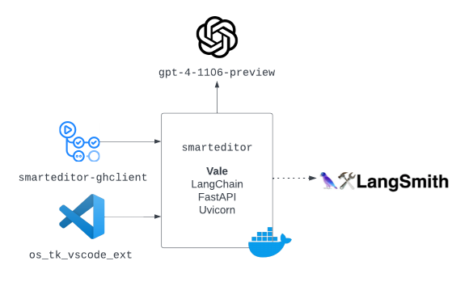

# smarteditor-ghclient

 [](https://sonarcloud.io/summary/new_code?id=jonathanalgar_activator-ghclient) [](https://sonarcloud.io/summary/new_code?id=jonathanalgar_activator-ghclient) [](https://makeapullrequest.com) 

> :bulb: *Full demo:* https://github.com/jonathanalgar/docs-demo/pull/2

## Overview

[](https://jonathanalgar.github.io/slides/Using%20AI%20and%20LLMs%20in%20docs-as-code%20pipelines.pdf)

Containerized GitHub action for interacting with the [smarteditor](https://github.com/jonathanalgar/smarteditor) service.

On a trigger comment in a pull request, the action sends the text of a supported file in a request to the [smarteditor](https://github.com/jonathanalgar/smarteditor) service for transformation. It then takes a response from the service, formats accordingly, and posts in-line suggestions or a block comment.

 ## Usage

First, create a new GitHub action workflow in your repo (eg. `.github/workflows/smarteditor.yml`):

```yaml
name: smarteditor

on:
  issue_comment:
    types:
      - created

permissions:
  contents: write
  pull-requests: write
  issues: write

jobs:
  smarteditor-ghclient:
    runs-on: ubuntu-latest
    if: contains(github.event.comment.body, '/smarteditor')
    container: 
      image: ghcr.io/jonathanalgar/smarteditor-ghclient:latest
      credentials:
        username: ${{ github.actor }}
        password: ${{ secrets.GITHUB_TOKEN }}

    steps:
      - name: Add reaction to comment
        run: |
          COMMENT_ID=${{ github.event.comment.id }}
          curl -X POST -H "Authorization: token ${{ secrets.GITHUB_TOKEN }}" \
               -H "Content-Type: application/json" \
               -d '{"content":"eyes"}' \
               "https://api.github.com/repos/${{ github.repository }}/issues/comments/$COMMENT_ID/reactions"
      - name: Set ref for checkout
        id: set_ref
        run: |
          PR_API_URL="${{ github.event.issue.pull_request.url }}"
          REF=$(curl -s -H "Authorization: token ${{ secrets.GITHUB_TOKEN }}" $PR_API_URL | jq -r .head.ref)
          echo "REF=$REF" >> $GITHUB_ENV
      - name: Checkout
        uses: actions/checkout@v4.1.1
        with:
          fetch-depth: 1
          ref: ${{ env.REF }}

      - name: Run script
        env:
          GITHUB_REPOSITORY: ${{ github.repository }}
          PR_NUMBER: ${{ github.event.issue.number }}
          SMARTEDITOR_ENDPOINT: ${{ secrets.SMARTEDITOR_ENDPOINT }}
          SMARTEDITOR_TOKEN: ${{ secrets.SMARTEDITOR_TOKEN }}
          GITHUB_TOKEN: ${{ secrets.GITHUB_TOKEN }}
          COMMENT_BODY: ${{ github.event.comment.body }}
          COMMENT_ID: ${{ github.event.comment.id }}
        run: python /app/smarteditor-ghclient.py
```

You'll need to [add the following repo secrets](https://docs.github.com/en/codespaces/managing-codespaces-for-your-organization/managing-development-environment-secrets-for-your-repository-or-organization#adding-secrets-for-a-repository):

* `SMARTEDITOR_ENDPOINT`: Endpoint URL of the running `smarteditor` (eg. `https://smarteditor-prod.westeurope.cloudapp.azure.com:9100/smarteditor`)
* `SMARTEDITOR_TOKEN`: Single token for service.

Optionally you can [add repo environment variables](https://docs.github.com/en/actions/learn-github-actions/variables#creating-configuration-variables-for-a-repository) `SMARTEDITOR_GITHUB_TOKEN_OVERRIDE` (text of a repo secret name, for example `CR_TOKEN`—if using pass the secret in `alttexter.yml`), `SMARTEDITOR_GITHUB_USERNAME` & `SMARTEDITOR_GITHUB_EMAIL` to override the default GitHub token, username and email used for commits.

Once that's done you can comment `/smarteditor /path/to/file.md` in a pull request to trigger the action.

## TODO

- [ ] Better error handling
- [ ] Unit tests
- [ ] Extend this TODO list
